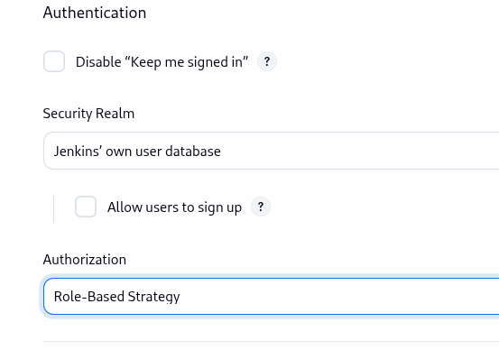
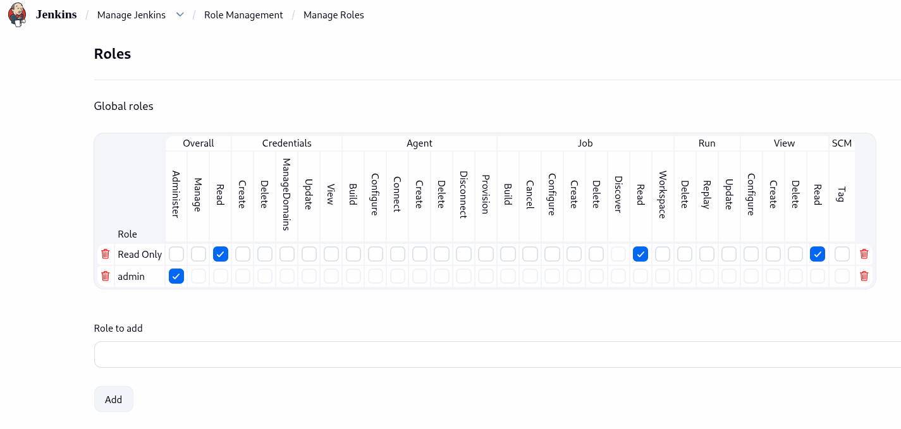
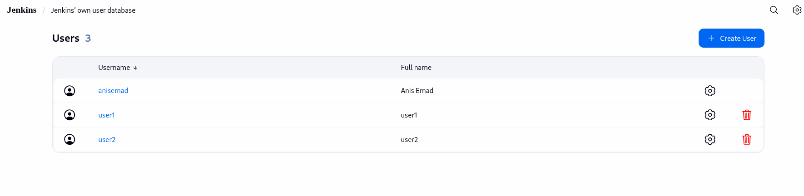
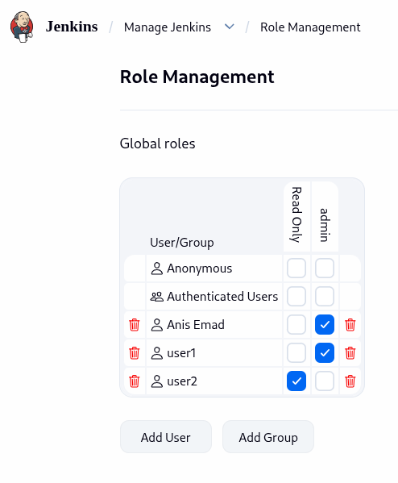

# Lab 21: Role-based Authorization (Jenkins)

## Objective
Create two Jenkins users, `user1` and `user2`, and restrict what each can do
using Jenkins' Role-Based Authorization Strategy: `user1` gets full admin
access, `user2` gets read-only access.

## Prerequisite: Install the Role-based Authorization Strategy plugin
Jenkins doesn't support per-user roles out of the box — the built-in
"Logged-in users can do anything" / "Matrix-based" strategies don't give a
clean way to define reusable named roles like "admin" vs "read-only".

**Manage Jenkins → Plugins → Available plugins** → search
`Role-based Authorization Strategy` → install → restart Jenkins if prompted.


## Steps & Commands

### 1. Enable the Role-Based Strategy
**Settings → Security → Authorization** → select
`Role-Based Strategy` → Save.


### 2. Create the roles
**Settings → Role Management → Manage Roles**

Under **Global roles**, add two roles:
- **`admin`** — check every permission (Overall/Administer, or simply check
  every box across all categories).
- **`read-only`** — check only:
  - Overall → Read
  - Job → Read
  - View → Read

Click **Save**.


### 3. Create the users
**Settings → Users → Create User** — create `user1` and `user2` with
their own credentials.


### 4. Assign roles to users
**Settings → Manage and Assign Roles → Assign Roles**

Under **Global roles**, add each user and check the matching role:
- `user1` → `admin`
- `user2` → `read-only`

Click **Save**.



## Project Structure
```
lab21/
│
└── README.md
```

## Result
| User | Role | Access confirmed |
|---|---|---|
| `user1` | `admin` | Full access — jobs, builds, Manage Jenkins |
| `user2` | `read-only` | Dashboard/job viewing only — no create/build/admin actions |