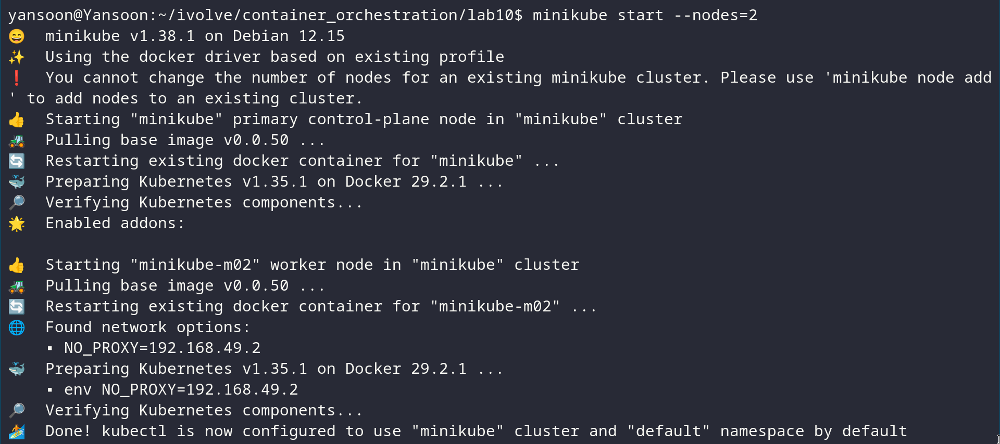
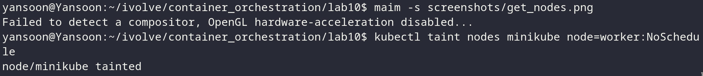
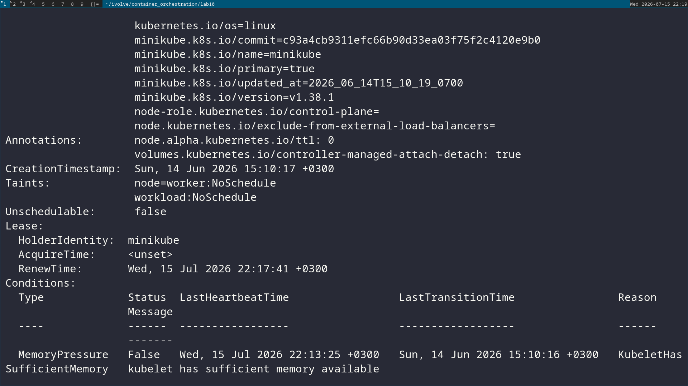
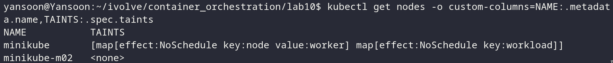

# Lab 10: Node Isolation Using Taints in Kubernetes

## Objective
Stand up a 2-node Kubernetes cluster, apply a taint to one node so that pods
are no longer scheduled onto it by default, and verify the taint is in place.

## Prerequisites
- A local Kubernetes tool that supports multi-node clusters — `minikube` or
  `kind` both work. This doc uses `minikube`; the `kind` equivalent is noted
  as an alternative.
- `kubectl` installed and configured.

## Steps & Commands

### 1. Start a 2-node cluster
**Using minikube:**
```bash
minikube start --nodes=2
```


**Alternative — using kind** (requires a config file since kind defaults to
a single node):
```yaml
# kind-config.yaml
kind: Cluster
apiVersion: kind.x-k8s.io/v1alpha4
nodes:
  - role: control-plane
  - role: worker
```
```bash
kind create cluster --config kind-config.yaml
```

### 2. Verify both nodes are up
```bash
kubectl get nodes
```


Note the name of the node you'll taint (e.g. `minikube-m02`, or the `kind`
worker node) — you'll need the exact name in the next step.

### 3. Taint one node
```bash
kubectl taint nodes <node-name> node=worker:NoSchedule
```


- `node=worker` — the taint's key=value.
- `NoSchedule` — the effect: the scheduler will not place new pods on this
  node unless they carry a matching toleration. It does **not** evict pods
  already running there.

### 4. Describe all nodes to verify the taint
```bash
kubectl describe nodes
```


Look for the `Taints:` field in the output — the tainted node should show:
```
Taints:             node=worker:NoSchedule
```
while the other node shows:
```
Taints:             <none>
```

For a quicker check across all nodes at once:
```bash
kubectl get nodes -o custom-columns=NAME:.metadata.name,TAINTS:.spec.taints
```


## Project Structure
```
lab10/
│
├── kind-config.yaml   (only if using kind instead of minikube)
└── README.md
```

## Result
| Node | Taint |
|---|---|
| node 1 (tainted) | `node=worker:NoSchedule` |
| node 2 | none |

