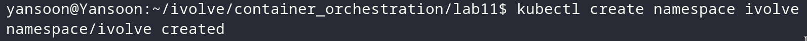
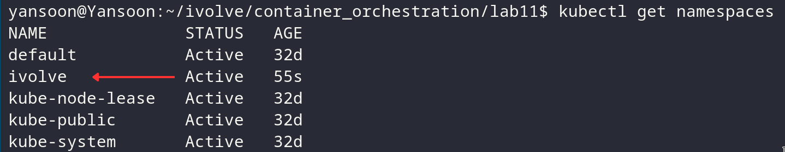
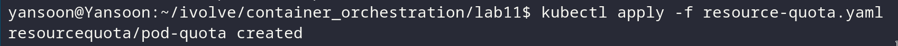
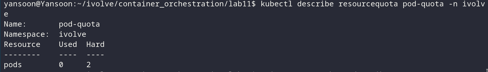
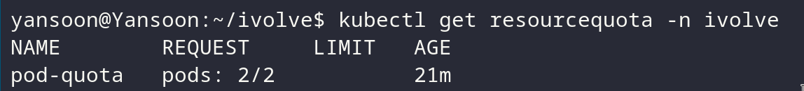
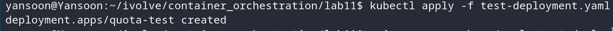
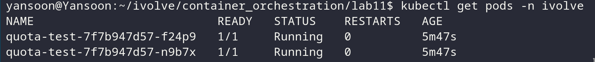

# Lab 11: Namespace Management and Resource Quota Enforcement

## Objective
Create a dedicated namespace, apply a `ResourceQuota` that caps the namespace to
2 pods, and confirm the cluster actually enforces that limit by trying to exceed it.

## Steps & Commands

### 1. Create the ivolve namespace
```bash
kubectl create namespace ivolve
```


Verify it:
```bash
kubectl get namespaces
```


### 2. Apply the resource quota
`resource-quota.yaml`:
```yaml
apiVersion: v1
kind: ResourceQuota
metadata:
  name: pod-quota
  namespace: ivolve
spec:
  hard:
    pods: "2"
```

```bash
kubectl apply -f resource-quota.yaml
```


### 3. Verify the quota is in place
```bash
kubectl describe resourcequota pod-quota -n ivolve
```


Or a quick summary:
```bash
kubectl get resourcequota -n ivolve
```


### 4. Prove enforcement — try to exceed the limit
`test-deployment.yaml` requests 3 replicas, one more than the quota allows:
```yaml
apiVersion: apps/v1
kind: Deployment
metadata:
  name: quota-test
  namespace: ivolve
spec:
  replicas: 3
  selector:
    matchLabels:
      app: quota-test
  template:
    metadata:
      labels:
        app: quota-test
    spec:
      containers:
        - name: nginx
          image: nginx:alpine
```

```bash
kubectl apply -f test-deployment.yaml
```


Check what actually came up:
```bash
kubectl get pods -n ivolve
```


Expect to see only **2** pods running.

## Project Structure
```
lab11/
│
├── resource-quota.yaml
├── test-deployment.yaml
└── README.md
```