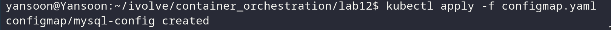
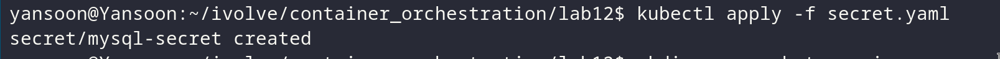
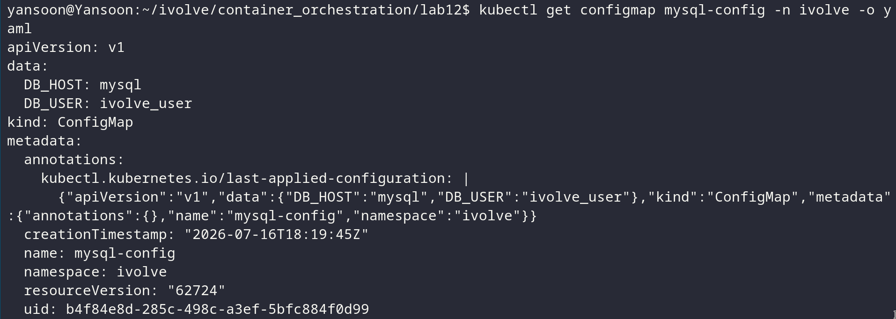
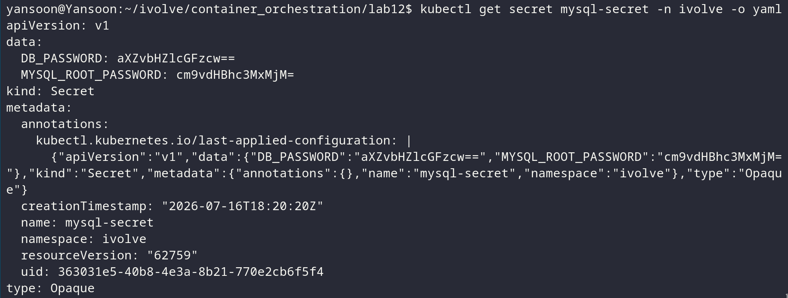
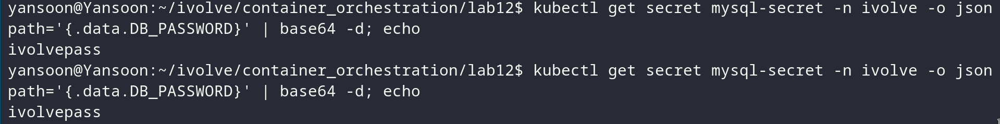

# Lab 12: Managing Configuration and Sensitive Data with ConfigMaps and Secrets

## Objective
Split MySQL connection settings into two Kubernetes objects based on
sensitivity: a `ConfigMap` for values that are fine to see in plain text
(hostname, username), and a `Secret` for values that should not be — the
database password and the MySQL root password — encoded in base64 as
Kubernetes requires.

## ConfigMap
`configmap.yaml`:
```yaml
apiVersion: v1
kind: ConfigMap
metadata:
  name: mysql-config
  namespace: ivolve
data:
  DB_HOST: "mysql"
  DB_USER: "ivolve_user"
```
- **`DB_HOST: "mysql"`** 
- **`DB_USER`** — the application's database user, not the MySQL root user.

## Secret
`secret.yaml`:
```yaml
apiVersion: v1
kind: Secret
metadata:
  name: mysql-secret
  namespace: ivolve
type: Opaque
data:
  DB_PASSWORD: aXZvbHZlcGFzcw==
  MYSQL_ROOT_PASSWORD: cm9vdHBhc3MxMjM=
```

The base64 values above were generated with:
```bash
echo -n "ivolvepass" | base64     # → aXZvbHZlcGFzcw==
echo -n "rootpass123" | base64    # → cm9vdHBhc3MxMjM=
```
Replace `ivolvepass` / `rootpass123` with your real password values before
encoding — these are placeholders.

> **Important:** base64 is an *encoding*, not encryption — anyone with access
> to read the Secret object can trivially decode it back to plain text. It
> satisfies Kubernetes' storage format requirement, not real confidentiality.


## Steps & Commands

### 1. Create the namespace (if not already created in Lab 11)
```bash
kubectl create namespace ivolve
```

### 2. Apply the ConfigMap
```bash
kubectl apply -f configmap.yaml
```


### 3. Apply the Secret
```bash
kubectl apply -f secret.yaml
```


### 4. Verify the ConfigMap
```bash
kubectl get configmap mysql-config -n ivolve -o yaml
```

Values are stored and shown in plain text, as expected for non-sensitive data.

### 5. Verify the Secret
```bash
kubectl get secret mysql-secret -n ivolve -o yaml
```

Values here show up base64-encoded, not in plain text.

### 6. Decode the Secret to confirm the values round-trip correctly
```bash
kubectl get secret mysql-secret -n ivolve -o jsonpath='{.data.DB_PASSWORD}' | base64 -d; echo
kubectl get secret mysql-secret -n ivolve -o jsonpath='{.data.MYSQL_ROOT_PASSWORD}' | base64 -d; echo
```


## Project Structure
```
lab12/
│
├── configmap.yaml
├── secret.yaml
└── README.md
```

## Result
| Object | Key | Value shown as |
|---|---|---|
| ConfigMap `mysql-config` | `DB_HOST` | plain text |
| ConfigMap `mysql-config` | `DB_USER` | plain text |
| Secret `mysql-secret` | `DB_PASSWORD` | base64-encoded |
| Secret `mysql-secret` | `MYSQL_ROOT_PASSWORD` | base64-encoded |

