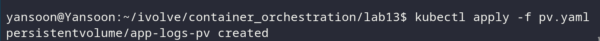
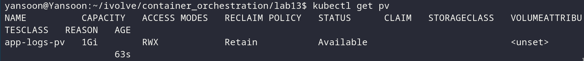
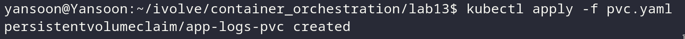
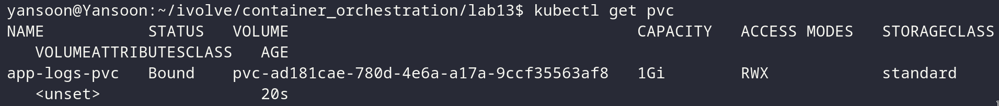
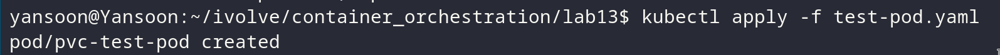
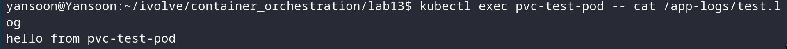

# Lab 13: Persistent Storage Setup for Application Logging

## Objective
Define a `PersistentVolume` backed by a path on the node's filesystem, a
matching `PersistentVolumeClaim` that binds to it, and verify the claim is
actually usable by mounting it in a test pod.

## PersistentVolume
`pv.yaml`:
```yaml
apiVersion: v1
kind: PersistentVolume
metadata:
  name: app-logs-pv
spec:
  capacity:
    storage: 1Gi
  accessModes:
    - ReadWriteMany
  persistentVolumeReclaimPolicy: Retain
  hostPath:
    path: /mnt/app-logs
```

## PersistentVolumeClaim
`pvc.yaml`:
```yaml
apiVersion: v1
kind: PersistentVolumeClaim
metadata:
  name: app-logs-pvc
spec:
  accessModes:
    - ReadWriteMany
  resources:
    requests:
      storage: 1Gi
```

- The PVC's `accessModes` and `storage` request must match (or be satisfiable
  by) the PV for Kubernetes to bind them together — both are `ReadWriteMany` /
  `1Gi` here, so they'll bind directly to each other with no other PV in the
  cluster competing for the claim.
- No `storageClassName` is set on either object, so both default to the empty
  string `""` — this is what lets a manually-created PV/PVC pair bind directly
  without a dynamic provisioner getting involved.

## Steps & Commands

### 1. Apply the PersistentVolume
```bash
kubectl apply -f pv.yaml
```


Verify it:
```bash
kubectl get pv
```

Status should show `Available` before anything claims it.

### 2. Apply the PersistentVolumeClaim
```bash
kubectl apply -f pvc.yaml
```


Verify it:
```bash
kubectl get pvc
```

Status should now show `Bound`, and re-checking `kubectl get pv` should show
the PV's status as `Bound` too, with `CLAIM` pointing at `app-logs-pvc`.

### 3. Verify the claim is actually usable — mount it in a test pod
`test-pod.yaml`:
```yaml
apiVersion: v1
kind: Pod
metadata:
  name: pvc-test-pod
spec:
  containers:
    - name: busybox
      image: busybox
      command: ["sh", "-c", "echo 'hello from pvc-test-pod' >> /app-logs/test.log && sleep 3600"]
      volumeMounts:
        - name: app-logs
          mountPath: /app-logs
  volumes:
    - name: app-logs
      persistentVolumeClaim:
        claimName: app-logs-pvc
```
```bash
kubectl apply -f test-pod.yaml
```


Confirm the write actually landed on the node's filesystem at the hostPath:
```bash
kubectl exec pvc-test-pod -- cat /app-logs/test.log
```



### 4. Clean up the test pod 
```bash
kubectl delete pod pvc-test-pod
```


## Project Structure
```
lab13/
│
├── pv.yaml
├── pvc.yaml
├── test-pod.yaml
└── README.md
```

## Result
| Object | Spec | Status |
|---|---|---|
| PV `app-logs-pv` | 1Gi, hostPath `/mnt/app-logs`, RWX, Retain | Bound |
| PVC `app-logs-pvc` | 1Gi, RWX | Bound |
| Test pod write | `/app-logs/test.log` | Confirmed written and readable |

