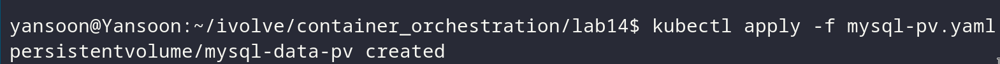
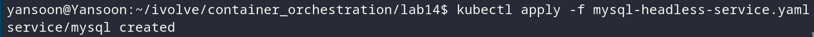
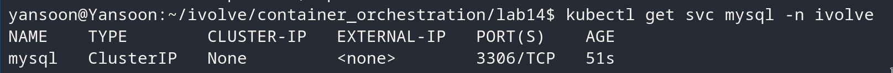
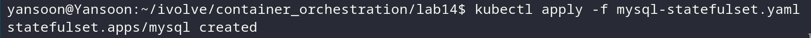
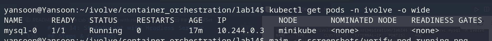
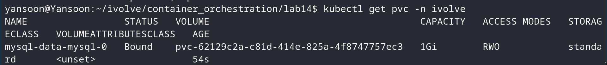
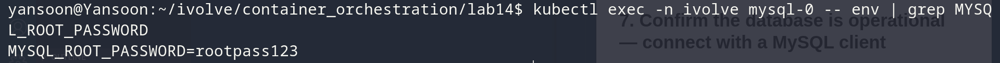
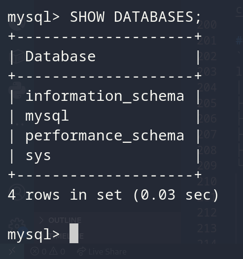

# Lab 14: StatefulSet with Headless Service

## Objective
Run MySQL as a single-replica `StatefulSet`, sourcing its root password from
the Secret created in Lab 12, tolerating the taint applied in Lab 10, and
persisting its data directory on a dedicated PVC. Expose it via a headless
Service so it gets stable DNS, and confirm it's actually reachable with a
MySQL client.

## Prerequisites Check
This StatefulSet directly references three things created in earlier labs: the
taint (Lab 10), the namespace (Lab 11), and the Secret (Lab 12). These aren't
being redone from scratch here — but rather than just assume they're still
there, verify each one first, and only recreate it if it's actually missing
(e.g. a fresh cluster, or the earlier lab's resources were cleaned up since).

**Namespace (Lab 11):**
```bash
kubectl get namespace ivolve
```
If missing:
```bash
kubectl create namespace ivolve
```

**Taint on the node (Lab 10):**
```bash
kubectl describe nodes | grep -A2 Taints
```
If the `node=worker:NoSchedule` taint isn't listed on any node, recreate it:
```bash
kubectl taint nodes <node-name> node=worker:NoSchedule
```

**Secret `mysql-secret` (Lab 12):**
```bash
kubectl get secret mysql-secret -n ivolve
```
If missing, reapply `secret.yaml` from Lab 12.


## MySQL Data PV
`mysql-pv.yaml`:
```yaml
apiVersion: v1
kind: PersistentVolume
metadata:
  name: mysql-data-pv
spec:
  capacity:
    storage: 1Gi
  accessModes:
    - ReadWriteOnce
  persistentVolumeReclaimPolicy: Retain
  hostPath:
    path: /mnt/mysql-data
```
- **`ReadWriteOnce`**, not `ReadWriteMany` — MySQL is a single replica here, and
  a database's data directory should never be written by more than one MySQL
  process at once anyway, so RWX would be actively wrong for this use case

## Headless Service
`mysql-headless-service.yaml`:
```yaml
apiVersion: v1
kind: Service
metadata:
  name: mysql
  namespace: ivolve
spec:
  clusterIP: None
  selector:
    app: mysql
  ports:
    - port: 3306
      targetPort: 3306
```
- **`clusterIP: None`** is what makes this a headless Service — instead of
  load-balancing through a single virtual IP, DNS returns the individual pod
  IP(s) directly. Combined with the StatefulSet's `serviceName`, this is what
  gives each MySQL pod a stable, predictable DNS name
  (`mysql-0.mysql.ivolve.svc.cluster.local`).

## StatefulSet
`mysql-statefulset.yaml`:
```yaml
apiVersion: apps/v1
kind: StatefulSet
metadata:
  name: mysql
  namespace: ivolve
spec:
  serviceName: mysql
  replicas: 1
  selector:
    matchLabels:
      app: mysql
  template:
    metadata:
      labels:
        app: mysql
    spec:
      tolerations:
        - key: "node"
          operator: "Equal"
          value: "worker"
          effect: "NoSchedule"
      containers:
        - name: mysql
          image: mysql:8.0
          ports:
            - containerPort: 3306
          env:
            - name: MYSQL_ROOT_PASSWORD
              valueFrom:
                secretKeyRef:
                  name: mysql-secret
                  key: MYSQL_ROOT_PASSWORD
          volumeMounts:
            - name: mysql-data
              mountPath: /var/lib/mysql
  volumeClaimTemplates:
    - metadata:
        name: mysql-data
      spec:
        accessModes:
          - ReadWriteOnce
        resources:
          requests:
            storage: 1Gi
```


## Steps & Commands

### 1. Apply the MySQL data PV
```bash
kubectl apply -f mysql-pv.yaml
```


### 2. Apply the headless service
```bash
kubectl apply -f mysql-headless-service.yaml
```


Verify it has no cluster IP:
```bash
kubectl get svc mysql -n ivolve
```

`CLUSTER-IP` should show `None`.

### 3. Apply the StatefulSet
```bash
kubectl apply -f mysql-statefulset.yaml
```


### 4. Verify the pod is running and tolerating the taint
```bash
kubectl get pods -n ivolve -o wide
```

Check the `NODE` column — confirm it landed on the tainted node if that's
where it was expected to schedule.

### 5. Verify the PVC bound correctly
```bash
kubectl get pvc -n ivolve
```

Should show `mysql-data-mysql-0` as `Bound` against `mysql-data-pv`.

### 6. Confirm the root password came from the Secret
```bash
kubectl exec -n ivolve mysql-0 -- env | grep MYSQL_ROOT_PASSWORD
```

(Value will be visible here since `env` inside the container always shows the
resolved value — the Secret only keeps it encoded/restricted at the API/etcd
level, not from a process that already has it injected.)

### 7. Confirm the database is operational

```bash
kubectl exec -it mysql-0 -n ivolve -- mysql -u root -p
```
Enter the root password when prompted (same value used for
`MYSQL_ROOT_PASSWORD`), then confirm the connection works:
```sql
SHOW DATABASES;
```


## Project Structure
```
lab14/
│
├── mysql-pv.yaml
├── mysql-headless-service.yaml
├── mysql-statefulset.yaml
└── README.md
```
