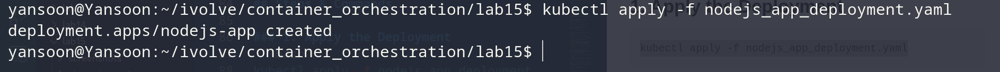
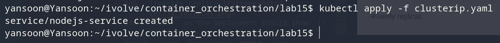
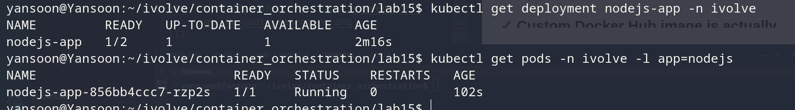

# Lab 15: Node.js Application Deployment with ClusterIP Service

## Objective
Deploy the Node.js app as a `Deployment` with 2 replicas, wired up to
ConfigMap/Secret-based config, tolerating the Lab 10 taint, mounting the
static PV from Lab 13 for logs, and expose it via a `ClusterIP` Service that
load-balances across whatever replicas are actually running.


## Deployment
`nodejs_app_deployment.yaml`:
```yaml
apiVersion: apps/v1
kind: Deployment
metadata:
  name: nodejs-app
  labels:
    app: nodejs
  namespace: ivolve
spec:
  replicas: 2
  selector:
    matchLabels:
      app: nodejs
  template:
    metadata:
      labels:
        app: nodejs
    spec:
      tolerations:
        - key: "node"
          operator: "Equal"
          value: "worker"
          effect: "NoSchedule"
      volumes:
        - name: app-logs
          persistentVolumeClaim:
            claimName: app-logs-pvc
      containers:
      - name: my-nodejs-app
        image: yansoon10/lab9-app
        ports:
          - containerPort: 3000
        env:
          - name: DB_HOST
            valueFrom:
              configMapKeyRef:
                name: mysql-config
                key: DB_HOST
          - name: DB_USER
            valueFrom:
              configMapKeyRef:
                name: mysql-config
                key: DB_USER
          - name: DB_PASSWORD
            valueFrom:
              secretKeyRef:
                name: mysql-secret
                key: DB_PASSWORD
        volumeMounts:
          - name: app-logs
            mountPath: /app/logs
```


## Service
`clusterip.yaml`:
```yaml
apiVersion: v1
kind: Service
metadata:
  name: nodejs-service
  namespace: ivolve
spec:
  type: ClusterIP
  selector:
    app: nodejs
  ports:
    - port: 80
      targetPort: 3000
```


## Steps & Commands

### 1. Apply the Deployment
```bash
kubectl apply -f nodejs_app_deployment.yaml
```


### 2. Apply the Service
```bash
kubectl apply -f clusterip.yaml
```


## Verification Checklist

### ✓ Deployment created, 2 replicas requested, 1 actually running
```bash
kubectl get deployment nodejs-app -n ivolve
kubectl get pods -n ivolve -l app=nodejs
```

`READY` on the Deployment should show `1/2`. 


## Project Structure
```
lab15/
│
├── nodejs_app_deployment.yaml
├── clusterip.yaml
└── README.md

```