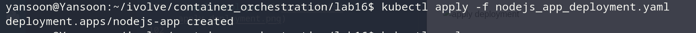
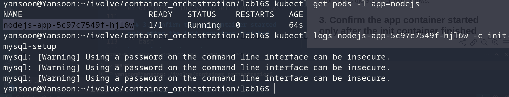
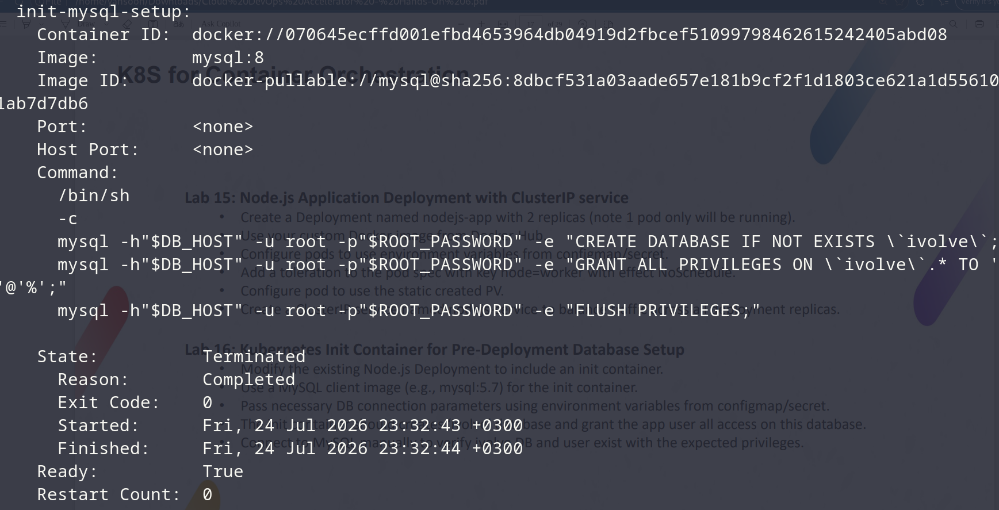
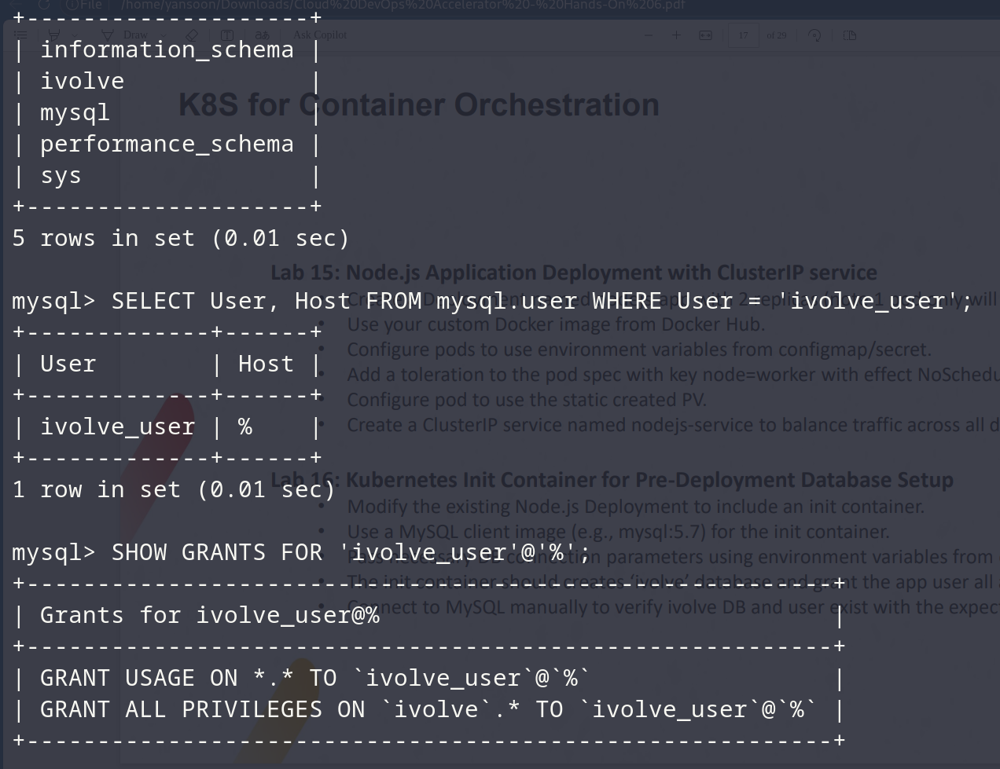

# Lab 16: Kubernetes Init Container for Pre-Deployment Database Setup

## Objective
Add an init container to the existing `nodejs-app` Deployment so that,
before the app container starts, the `ivolve` database is created and the
app's database user is granted full privileges on it.

## Depends On Earlier Labs
- **Lab 12** — `mysql-config` (ConfigMap) and `mysql-secret` (Secret), used
  to feed the init container its connection parameters.
- **Lab 13** — `app-logs-pvc`, still mounted by the main app container.
- **Lab 15** — the base `nodejs-app` Deployment this lab modifies.

## Deployment (with init container added)
`nodejs_app_deployment.yaml`:
```yaml
apiVersion: apps/v1
kind: Deployment
metadata:
  name: nodejs-app
  labels:
    app: nodejs
  namespace: ivolve
spec:
  replicas: 2
  selector:
    matchLabels:
      app: nodejs
  template:
    metadata:
      labels:
        app: nodejs
    spec:
      tolerations:
        - key: "node"
          operator: "Equal"
          value: "worker"
          effect: "NoSchedule"
      initContainers:
        - name: init-mysql-setup
          image: mysql:8
          env:
            - name: ROOT_PASSWORD
              valueFrom:
                secretKeyRef:
                  name: mysql-secret
                  key: MYSQL_ROOT_PASSWORD
            - name: DB_HOST
              valueFrom:
                configMapKeyRef:
                  name: mysql-config
                  key: DB_HOST
            - name: DB_USER
              valueFrom:
                configMapKeyRef:
                  name: mysql-config
                  key: DB_USER
          command:
            - /bin/sh
            - -c
            - |
              mysql -h"$DB_HOST" -u root -p"$ROOT_PASSWORD" -e "CREATE DATABASE IF NOT EXISTS \`ivolve\`;"
              mysql -h"$DB_HOST" -u root -p"$ROOT_PASSWORD" -e "GRANT ALL PRIVILEGES ON \`ivolve\`.* TO '$DB_USER'@'%';"
              mysql -h"$DB_HOST" -u root -p"$ROOT_PASSWORD" -e "FLUSH PRIVILEGES;"
      containers:
      - name: my-nodejs-app
        image: yansoon10/lab9-app
        ports:
          - containerPort: 3000
        env:
          - name: DB_HOST
            valueFrom:
              configMapKeyRef:
                name: mysql-config
                key: DB_HOST
          - name: DB_USER
            valueFrom:
              configMapKeyRef:
                name: mysql-config
                key: DB_USER
          - name: DB_PASSWORD
            valueFrom:
              secretKeyRef:
                name: mysql-secret
                key: DB_PASSWORD
        volumeMounts:
          - name: app-logs
            mountPath: /app/logs
      volumes:
        - name: app-logs
          persistentVolumeClaim:
            claimName: app-logs-pvc
```

## Steps & Commands

### 1. Apply the updated Deployment
```bash
kubectl apply -f nodejs_app_deployment.yaml
```


### 2. Check the init container's status and logs
```bash
kubectl get pods -n ivolve -l app=nodejs
kubectl logs <nodejs-app-pod-name> -n ivolve -c init-mysql-setup
```

No output typically means success — the `mysql -e` commands only print on
error, unless the SQL itself returns rows.

### 3. Confirm the app container started only after the init container finished
```bash
kubectl describe pod <nodejs-app-pod-name> -n ivolve
```

Check the `Init Containers` section shows `State: Terminated, Reason:
Completed`, and the main container shows `Running` underneath it.

### 4. Connect to MySQL manually to verify the database and privileges
```bash
kubectl exec -it mysql-0 -n ivolve -- mysql -u root -p
```
```sql
SHOW DATABASES;
SELECT User, Host FROM mysql.user WHERE User = 'ivolve_user';
SHOW GRANTS FOR 'ivolve_user'@'%';
```

Expect `ivolve` in the database list, and `SHOW GRANTS` returning something
like `GRANT ALL PRIVILEGES ON \`ivolve\`.* TO \`ivolve_user\`@\`%\``.

## Project Structure
```
lab16/
│
├── nodejs_app_deployment.yaml
├── clusterip.yaml
└── README.md
```

## Result
| Requirement | Outcome |
|---|---|
| Init container added to `nodejs-app` Deployment | Confirmed via `kubectl describe pod` |
| MySQL client image used | `mysql:8` (matches server version) |
| Connection params from ConfigMap/Secret | Confirmed via init container env |
| `ivolve` database created | Confirmed via `SHOW DATABASES;` |
| App user granted privileges on `ivolve` | Confirmed via `SHOW GRANTS FOR 'ivolve_user'@'%';` |