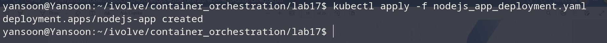
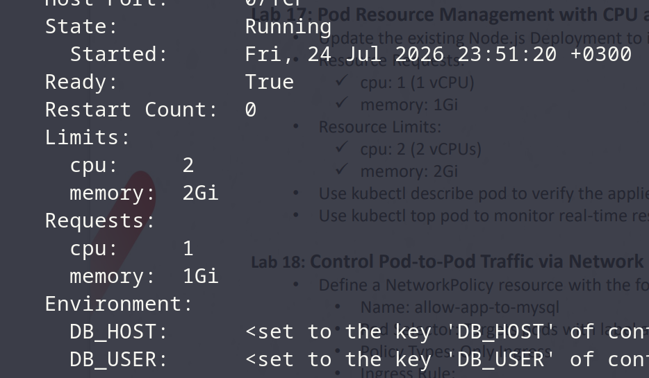
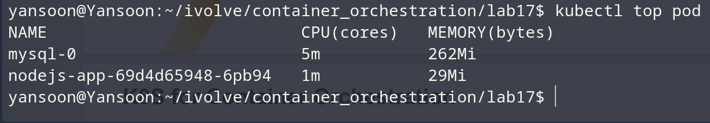

# Lab 17: Pod Resource Management with CPU and Memory Requests and Limits

## Objective
Update the `nodejs-app` Deployment's container to declare resource requests
and limits, then verify them with `kubectl describe pod` and monitor actual
usage with `kubectl top pod`.

## Change Made
Added under the `my-nodejs-app` container spec:
```yaml
resources:
  requests:
    cpu: "1"
    memory: "1Gi"
  limits:
    cpu: "2"
    memory: "2Gi"
```

## Steps & Commands

### 1. Apply the updated Deployment
```bash
kubectl apply -f nodejs_app_deployment.yaml
```


### 2. Verify requests/limits with kubectl describe pod
```bash
kubectl describe pod <nodejs-app-pod-name> -n ivolve
```

Check the container's `Limits` / `Requests` fields under its section in the
output.

### 3. Monitor real-time usage with kubectl top pod
```bash
kubectl top pod -n ivolve
```


> Requires the Metrics Server to be running in the cluster
> (`minikube addons enable metrics-server` on minikube). If `kubectl top`
> returns an error about metrics not being available, enable that first.

## Project Structure
```
lab17/
│
├── nodejs_app_deployment.yaml
├── clusterip.yaml
└── README.md
```

## Result
| Requirement | Outcome |
|---|---|
| CPU request: 1 | Confirmed via `kubectl describe pod` |
| Memory request: 1Gi | Confirmed via `kubectl describe pod` |
| CPU limit: 2 | Confirmed via `kubectl describe pod` |
| Memory limit: 2Gi | Confirmed via `kubectl describe pod` |
| Real-time usage visible | Confirmed via `kubectl top pod` |