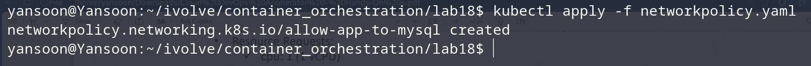
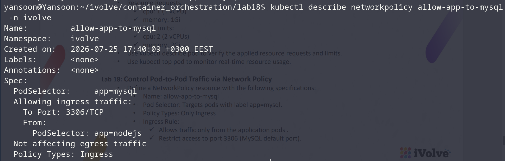
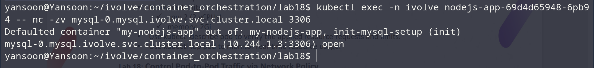

# Lab 18: Control Pod-to-Pod Traffic via Network Policy

## Objective
Restrict access to the MySQL pod so that only the Node.js app pods can reach
it, and only on port 3306.

## NetworkPolicy
`networkpolicy.yaml`:
```yaml
apiVersion: networking.k8s.io/v1
kind: NetworkPolicy
metadata:
  name: allow-app-to-mysql
  namespace: ivolve
spec:
  podSelector:
    matchLabels:
      app: mysql
  policyTypes:
    - Ingress
  ingress:
    - from:
        - podSelector:
            matchLabels:
              app: nodejs
      ports:
        - protocol: TCP
          port: 3306
```

> `podSelector: app: nodejs` matches the label used on the `nodejs-app`
> Deployment's pods (Lab 15). Adjust if your app pods use a different label.

## Steps & Commands

### 1. Apply the NetworkPolicy
```bash
kubectl apply -f networkpolicy.yaml
```


### 2. Verify it
```bash
kubectl describe networkpolicy allow-app-to-mysql -n ivolve
```


### 3. Confirm the app pod can still reach MySQL on 3306
```bash
kubectl exec -n ivolve <nodejs-app-pod-name> -- nc -zv mysql-0.mysql.ivolve.svc.cluster.local 3306
```



## Project Structure
```
lab18/
│
├── networkpolicy.yaml
└── README.md
```
