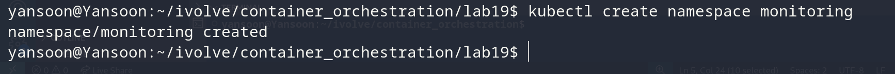
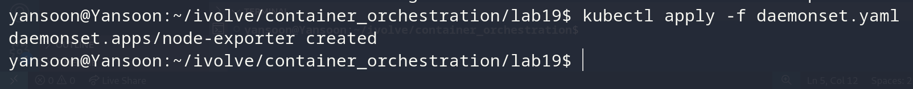
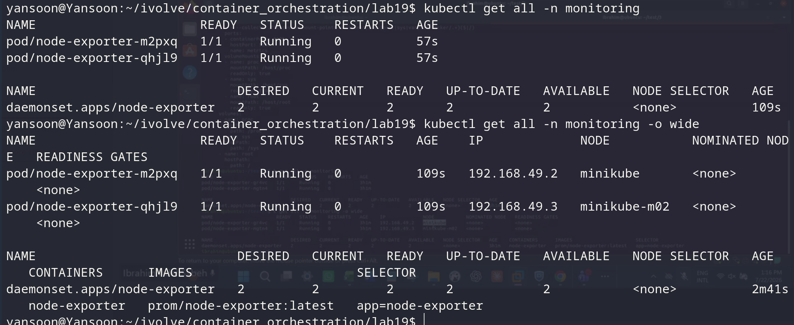
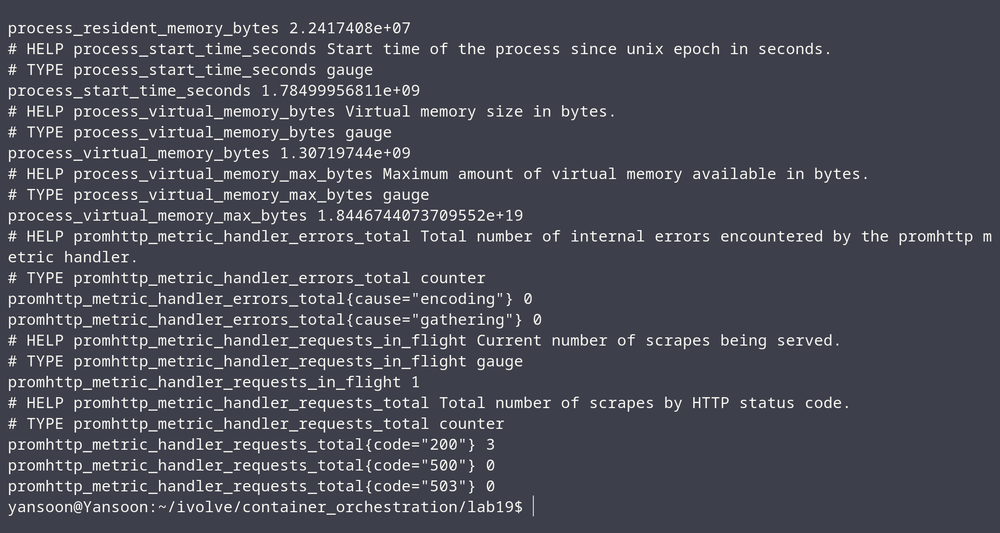

# Lab 19: Node-Wide Pod Management with DaemonSet

## Objective
Deploy Prometheus `node-exporter` as a DaemonSet so exactly one pod runs on
every node, tolerating all existing taints, and confirm metrics are exposed
on port 9100.

## DaemonSet
`daemonset.yaml`:
```yaml
apiVersion: apps/v1
kind: DaemonSet
metadata:
  name: node-exporter
  namespace: monitoring
  labels:
    app: node-exporter
spec:
  selector:
    matchLabels:
      app: node-exporter
  template:
    metadata:
      labels:
        app: node-exporter
    spec:
      hostNetwork: true
      hostPID: true
      tolerations:
        - operator: "Exists"
      containers:
      - name: node-exporter
        image: prom/node-exporter:latest
        args:
          - --path.procfs=/host/proc
          - --path.sysfs=/host/sys
          - --path.rootfs=/host/root
          - --collector.filesystem.mount-points-exclude=^/(dev|proc|sys|var/lib/docker/.*)($|/)
        ports:
        - containerPort: 9100
          hostPort: 9100
          name: metrics
        volumeMounts:
        - name: proc
          mountPath: /host/proc
          readOnly: true
        - name: sys
          mountPath: /host/sys
          readOnly: true
        - name: root
          mountPath: /host/root
          readOnly: true
      volumes:
      - name: proc
        hostPath:
          path: /proc
      - name: sys
        hostPath:
          path: /sys
      - name: root
        hostPath:
          path: /
```


## Steps & Commands

### 1. Create the monitoring namespace
```bash
kubectl create namespace monitoring
```


### 2. Apply the DaemonSet
```bash
kubectl apply -f daemonset.yaml
```


### 3. Verify a pod is scheduled on each node
```bash
kubectl get all -n monitoring -o wide
```

`DESIRED`, `CURRENT`, `READY`, and `AVAILABLE` all show `2` — one pod per
node, confirmed by the `NODE` column showing `minikube` and `minikube-m02`
respectively.

### 4. Confirm metrics exposure on port 9100
```bash
curl http://<node-ip>:9100/metrics
```

Returns Prometheus-formatted metrics output.

## Project Structure
```
lab19/
│
├── daemonset.yaml
└── README.md
```

## Result
| Requirement | Outcome |
|---|---|
| `monitoring` namespace created | Confirmed |
| DaemonSet tolerates all taints | `operator: "Exists"` toleration |
| One pod scheduled per node | Confirmed — 2 nodes, 2 pods, one each |
| Metrics exposed on :9100 | Confirmed via `curl .../metrics` |