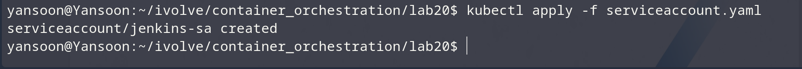
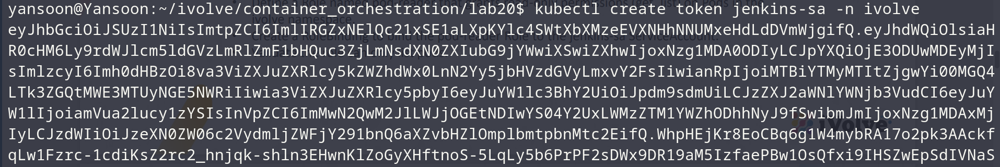
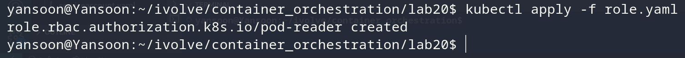
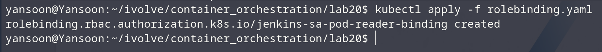
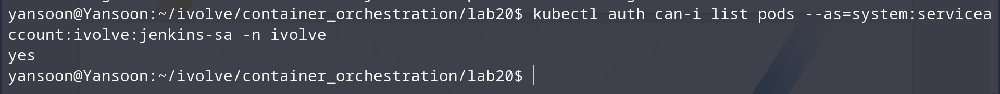
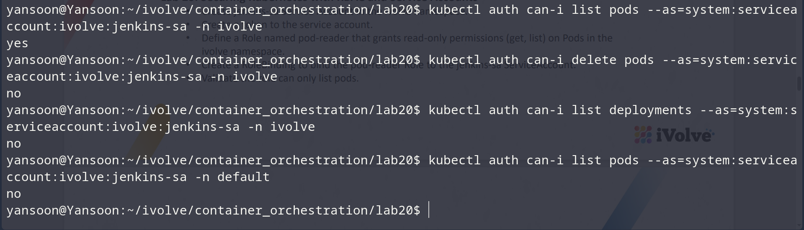

# Lab 20: Securing Kubernetes with RBAC and Service Accounts

## Objective
Create a `ServiceAccount` for Jenkins, grant it read-only access to Pods in
the `ivolve` namespace via a `Role` + `RoleBinding`, and confirm it can list
pods but not perform any other action.

## ServiceAccount
`serviceaccount.yaml`:
```yaml
apiVersion: v1
kind: ServiceAccount
metadata:
  name: jenkins-sa
  namespace: ivolve
```

## Role
`role.yaml`:
```yaml
apiVersion: rbac.authorization.k8s.io/v1
kind: Role
metadata:
  name: pod-reader
  namespace: ivolve
rules:
  - apiGroups: [""]
    resources: ["pods"]
    verbs: ["get", "list"]
```

## RoleBinding
`rolebinding.yaml`:
```yaml
apiVersion: rbac.authorization.k8s.io/v1
kind: RoleBinding
metadata:
  name: jenkins-sa-pod-reader-binding
  namespace: ivolve
subjects:
  - kind: ServiceAccount
    name: jenkins-sa
    namespace: ivolve
roleRef:
  kind: Role
  name: pod-reader
  apiGroup: rbac.authorization.k8s.io
```

## Steps & Commands

### 1. Apply the ServiceAccount
```bash
kubectl apply -f serviceaccount.yaml
```


### 2. Create a token for the ServiceAccount
```bash
kubectl create token jenkins-sa -n ivolve
```

Save this token — it's needed for the validation step below.

### 3. Apply the Role
```bash
kubectl apply -f role.yaml
```


### 4. Apply the RoleBinding
```bash
kubectl apply -f rolebinding.yaml
```


### 5. Validate — the ServiceAccount can list pods
```bash
kubectl auth can-i list pods --as=system:serviceaccount:ivolve:jenkins-sa -n ivolve
```

Should return `yes`.

### 6. Validate — the ServiceAccount cannot do anything else
```bash
kubectl auth can-i delete pods --as=system:serviceaccount:ivolve:jenkins-sa -n ivolve
kubectl auth can-i list deployments --as=system:serviceaccount:ivolve:jenkins-sa -n ivolve
kubectl auth can-i list pods --as=system:serviceaccount:ivolve:jenkins-sa -n default
```

Each of these should return `no` — confirming the Role's permissions are
scoped exactly to `get`/`list` on Pods, in the `ivolve` namespace only.

## Project Structure
```
lab20/
│
├── serviceaccount.yaml
├── role.yaml
├── rolebinding.yaml
└── README.md
```