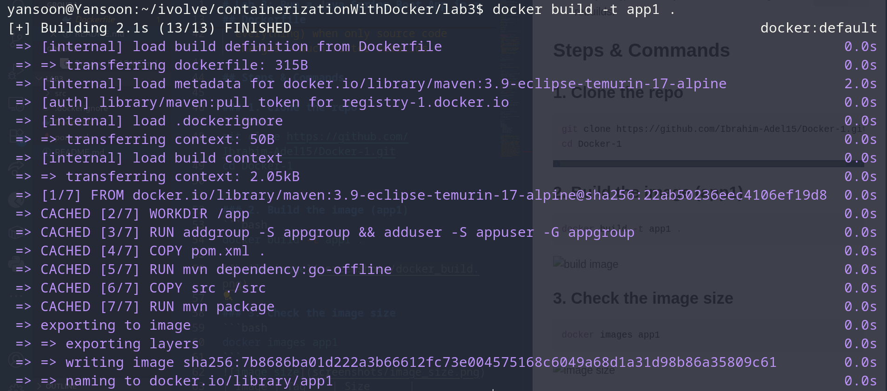
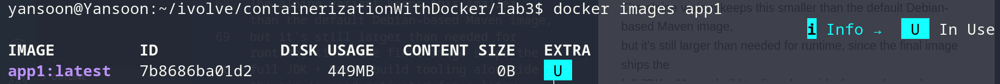
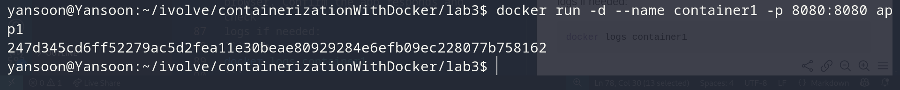
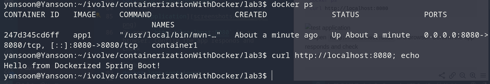
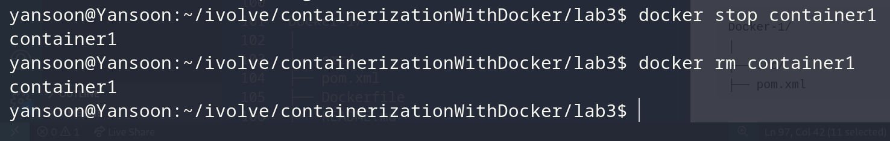

# Lab 3: Run a Java Spring Boot App in a Container

## Objective
Containerize a Java Spring Boot application using a Maven base image, build a Docker
image from it, run the app in a container, verify it works, then clean up.

## Application Source
Cloned from:
```
git clone https://github.com/Ibrahim-Adel15/Docker-1.git
```

## Dockerfile
```dockerfile
FROM maven:3.9-eclipse-temurin-17-alpine

WORKDIR /app

RUN addgroup -S appgroup && adduser -S appuser -G appgroup

COPY pom.xml .
RUN mvn dependency:go-offline

COPY src ./src
RUN mvn package

USER appuser

EXPOSE 8080

CMD ["java", "-jar", "target/demo-0.0.1-SNAPSHOT.jar"]
```

**Design choices beyond the base requirements:**
- **Alpine base** (`maven:3.9-eclipse-temurin-17-alpine`) instead of the default
  Debian-based image — smaller footprint.
- **Non-root user**: a dedicated `appuser`/`appgroup` is created and the app runs
  as that user instead of root, following container security best practice.
- **Dependency caching**: `pom.xml` is copied and `mvn dependency:go-offline` runs
  *before* copying the source code. This means Docker can cache the downloaded
  dependencies layer, so later builds only re-run `mvn package` (not re-download
  everything) when only source code changes — much faster rebuilds.

## Steps & Commands

### 1. Clone the repo
```bash
git clone https://github.com/Ibrahim-Adel15/Docker-1.git
cd Docker-1
```

### 2. Build the image (app1)
```bash
docker build -t app1 .
```


### 3. Check the image size
```bash
docker images app1
```



### 4. Run the container
```bash
docker run -d --name container1 -p 8080:8080 app1
```


### 5. Test the application
```bash
docker ps
curl http://localhost:8080
```

Or open `http://localhost:8080` in a browser. Confirm the app responds and check
logs if needed:
```bash
docker logs container1
```

### 6. Stop and remove the container
```bash
docker stop container1
docker rm container1
```


## Project Structure
```
Docker-1/
│
├── src/
├── pom.xml
├── Dockerfile
└── README.md
```

