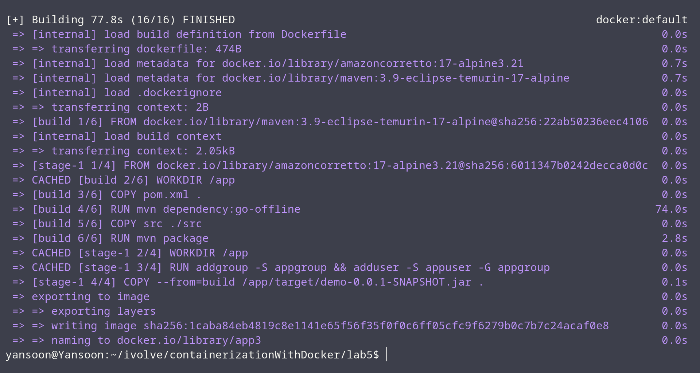
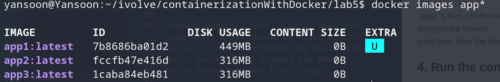
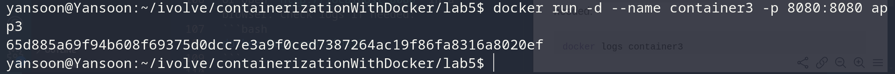
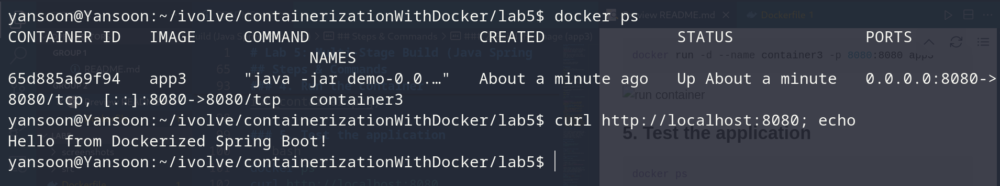
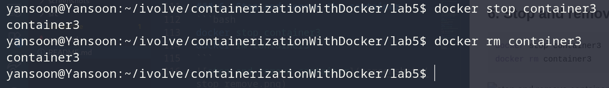

# Lab 5: Multi-Stage Build (Java Spring Boot App)

## Objective
Combine the build step (Lab 3) and the lightweight run step (Lab 4) into a single
**multi-stage** Dockerfile: one stage builds the JAR with Maven, a second, smaller
stage runs it on a plain Java 17 base image. Build the image, run it, verify it
works, then clean up — including deleting the image this time.

## Application Source
Cloned from:
```
git clone https://github.com/Ibrahim-Adel15/Docker-1.git
```

## Dockerfile
```dockerfile
# ---- Stage 1: Build ----
FROM maven:3.9-eclipse-temurin-17-alpine AS build

WORKDIR /app

COPY pom.xml .
RUN mvn dependency:go-offline

COPY src ./src
RUN mvn package

# ---- Stage 2: Run ----
FROM amazoncorretto:17-alpine3.21

WORKDIR /app

RUN addgroup -S appgroup && adduser -S appuser -G appgroup

COPY --from=build /app/target/demo-0.0.1-SNAPSHOT.jar .

USER appuser

EXPOSE 8080

CMD ["java", "-jar", "demo-0.0.1-SNAPSHOT.jar"]
```

**Design choices:**
- **Stage 1 (`build`)**: same Maven/Alpine base and dependency-caching pattern as
  Lab 3 — `pom.xml` copied and `mvn dependency:go-offline` run before the source
  code, so dependency downloads are cached across rebuilds.
- **Stage 2 (runtime)**: same Amazon Corretto JRE base and non-root user pattern
  as Lab 4.
- **`COPY --from=build`**: pulls only the finished JAR out of the build stage.
  Everything else from Stage 1 — Maven, the JDK build tools, source code,
  dependency cache — is discarded and never makes it into the final image.
- This gets you the best of both labs: the container can still build itself from
  source (no host Maven required, unlike Lab 4), but the final image is as small
  as Lab 4's, since none of the build tooling ships in the final layer.

## How This Compares
| | Lab 3 | Lab 4 | Lab 5 |
|---|---|---|---|
| Build location | Inside container | On host | Inside container (separate stage) |
| Final image contains | JDK + Maven + app | JRE + jar only | JRE + jar only |
| Requires host Maven? | No | Yes | No |
| Expected image size | Largest | Smallest | Small (~same as Lab 4) |

## Steps & Commands

### 1. Clone the repo
```bash
git clone https://github.com/Ibrahim-Adel15/Docker-1.git
cd Docker-1
```

### 2. Build the image (app3)
```bash
docker build -t app3 .
```


### 3. Check the image size
```bash
docker images app3
```


| Image | Tag    | Size |
|-------|--------|------|
| app3  | latest | *record actual size here* |

Compare against `app1` (Lab 3) and `app2` (Lab 4) — `app3` should be close to
`app2`'s size, confirming the multi-stage build successfully dropped the Maven
build layer from the final image.

### 4. Run the container
```bash
docker run -d --name container3 -p 8080:8080 app3
```


### 5. Test the application
```bash
docker ps
curl http://localhost:8080
```


Or open `http://localhost:8080` in a browser. Check logs if needed:
```bash
docker logs container3
```

### 6. Stop and remove the container
```bash
docker stop container3
docker rm container3
```


## Project Structure
```
Docker-1/
│
├── src/
├── pom.xml
├── Dockerfile
└── README.md
```
