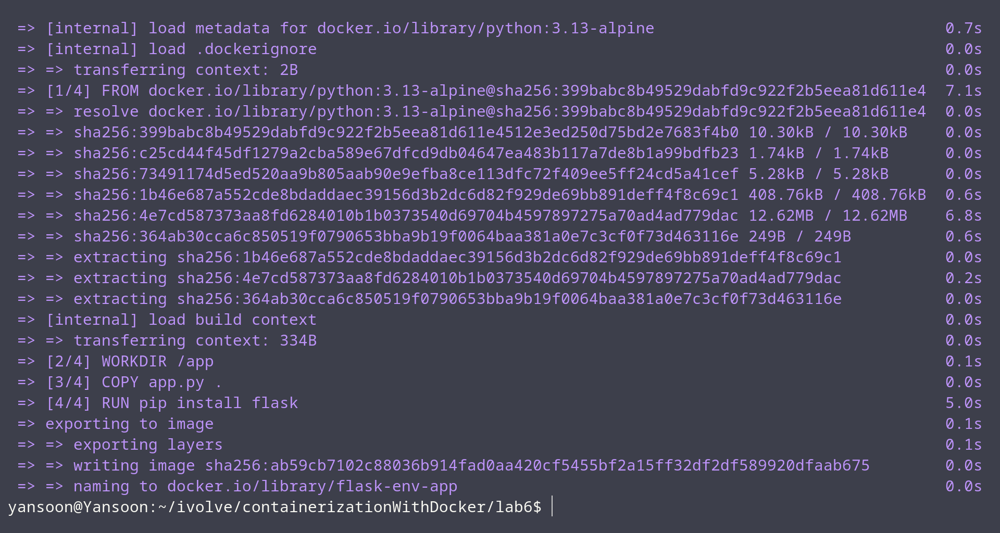
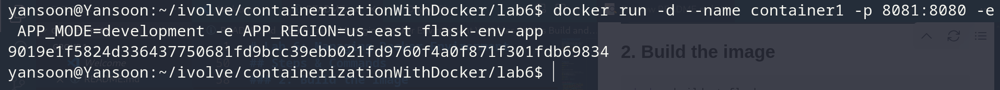
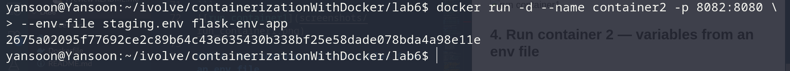
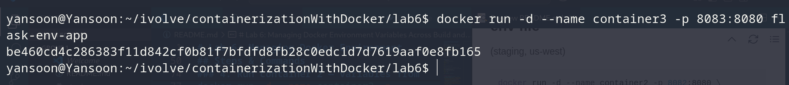
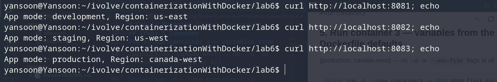
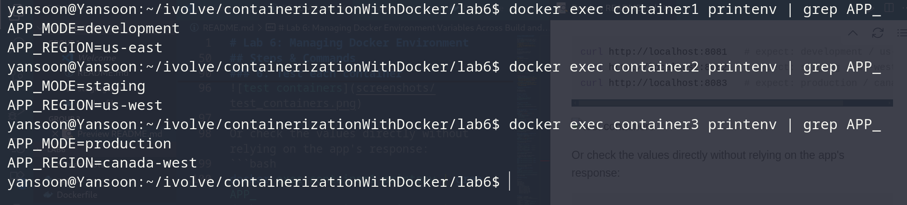
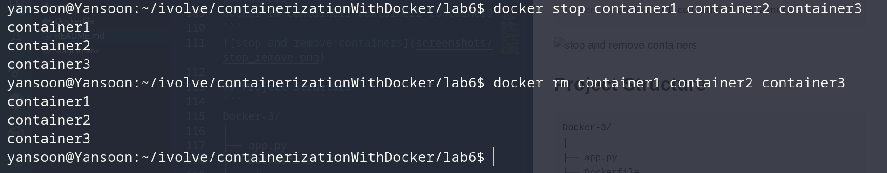

# Lab 6: Managing Docker Environment Variables Across Build and Runtime

## Objective
Build a single Flask app image, then run three containers from it that each get
their `APP_MODE` / `APP_REGION` values a different way:
1. passed directly on the `docker run` command line,
2. loaded from a separate env file,
3. left as the defaults baked into the Dockerfile.

## Application Source
Cloned from:
```
git clone https://github.com/Ibrahim-Adel15/Docker-3.git
cd Docker-3
```

## Dockerfile
```dockerfile
FROM python:3.13-alpine

WORKDIR /app

COPY . .

RUN pip install flask

# Default environment variables (used when a container is run with no overrides)
ENV APP_MODE=production
ENV APP_REGION=canada-west

EXPOSE 8080

CMD ["python", "app.py"]
```

**Design choices:**
- **`ENV APP_MODE=production` / `ENV APP_REGION=canada-west`**: these are the
  Dockerfile-level defaults — requirement (iii). Any container run *without*
  overriding them at runtime will get `production` / `canada-west`.
- One image is built once and reused for all three containers; only the way
  each `docker run` supplies environment variables changes.

## Env File (for container 2)
`staging.env`:
```
APP_MODE=staging
APP_REGION=us-west
```

## Steps & Commands

### 1. Clone the repo
```bash
git clone https://github.com/Ibrahim-Adel15/Docker-3.git
cd Docker-3
```

### 2. Build the image
```bash
docker build -t flask-env-app .
```


### 3. Run container 1 — variables passed on the command line
(development, us-east)
```bash
docker run -d --name container1 -p 8081:8080 \
  -e APP_MODE=development \
  -e APP_REGION=us-east \
  flask-env-app
```


### 4. Run container 2 — variables from an env file
(staging, us-west)
```bash
docker run -d --name container2 -p 8082:8080 \
  --env-file staging.env \
  flask-env-app
```


### 5. Run container 3 — variables from the Dockerfile defaults
(production, canada-west) — no `-e` or `--env-file` flags at all
```bash
docker run -d --name container3 -p 8083:8080 flask-env-app
```


### 6. Test each container
```bash
curl http://localhost:8081   # expect: development / us-east
curl http://localhost:8082   # expect: staging / us-west
curl http://localhost:8083   # expect: production / canada-west
```


Or check the values directly without relying on the app's response:
```bash
docker exec container1 printenv | grep APP_
docker exec container2 printenv | grep APP_
docker exec container3 printenv | grep APP_
```


### 7. Stop and remove all three containers
```bash
docker stop container1 container2 container3
docker rm container1 container2 container3
```


## Project Structure
```
Docker-3/
│
├── app.py
├── Dockerfile
├── staging.env
└── README.md
```

## Result
| Container  | APP_MODE    | APP_REGION  | Source of values |
|------------|-------------|-------------|-------------------|
| container1 | development | us-east     | `-e` flags on `docker run` |
| container2 | staging     | us-west     | `--env-file staging.env` |
| container3 | production  | canada-west | `ENV` defaults in the Dockerfile |