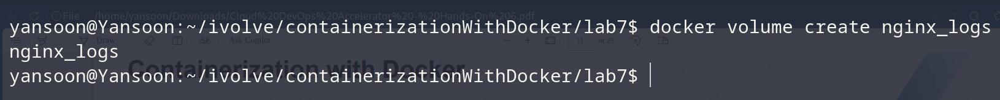
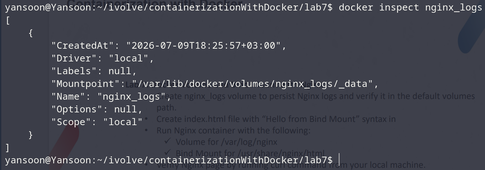
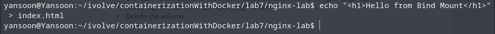
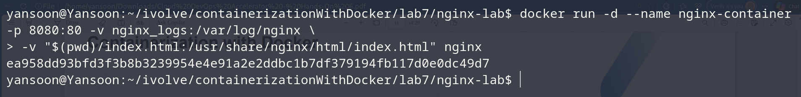
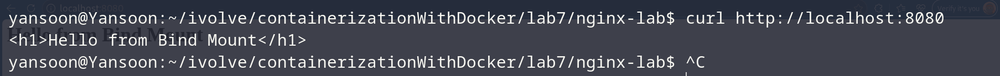
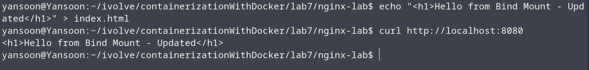
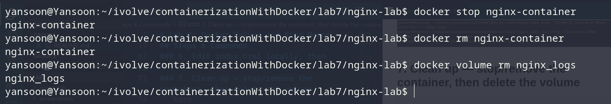

# Lab 7: Docker Volume and Bind Mount with Nginx

## Objective
Run an Nginx container using two different storage mechanisms at once:
- a **named volume** for `/var/log/nginx`, so logs persist independently of the
  container's lifecycle,
- a **bind mount** for `/usr/share/nginx/html`, so the page content is served
  directly from a file on the local machine and can be edited live.

Then verify both work as expected, and clean up.

## No Dockerfile Needed
This lab uses the official `nginx` image as-is — no custom image is built. The
volume and bind mount are set up entirely through `docker volume create` and
`docker run` flags.

## Steps & Commands

### 1. Create the nginx_logs volume
```bash
docker volume create nginx_logs
```


### 2. Verify it in the default volumes path
```bash
docker volume inspect nginx_logs
```
Look at the `Mountpoint` field in the output — by default this is under:
```
/var/lib/docker/volumes/nginx_logs/_data
```


### 3. Create index.html locally
```bash
mkdir nginx-lab && cd nginx-lab
echo "<h1>Hello from Bind Mount</h1>" > index.html
```


### 4. Run the Nginx container with volume + bind mount
```bash
docker run -d --name nginx-container -p 8080:80 \
  -v nginx_logs:/var/log/nginx \
  -v "$(pwd)/index.html:/usr/share/nginx/html/index.html" \
  nginx
```


- `-v nginx_logs:/var/log/nginx` → named **volume**, managed by Docker.
- `-v "$(pwd)/index.html:...".` → **bind mount**, points straight at a local file.

### 5. Verify the Nginx page
```bash
curl http://localhost:8080
```
Expect to see `Hello from Bind Mount` in the response.


### 6. Edit index.html locally, then verify again
```bash
echo "<h1>Hello from Bind Mount - Updated</h1>" > index.html
curl http://localhost:8080
```
Because this is a bind mount (not a copy baked into the image), the change on
the host is reflected immediately — no rebuild, no restart needed.



### 7. Clean up — stop/remove the container, then delete the volume
```bash
docker stop nginx-container
docker rm nginx-container
docker volume rm nginx_logs
```


## Project Structure
```
│
├── nginx-lab/
│   └── index.html
└── README.md
```
