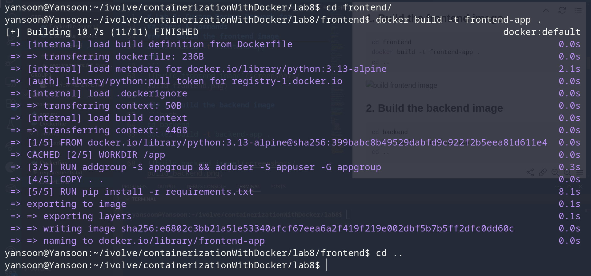
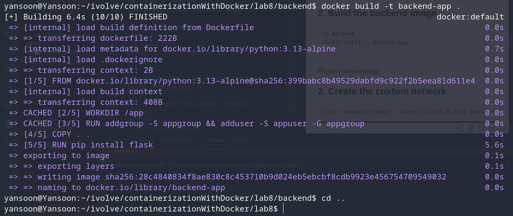
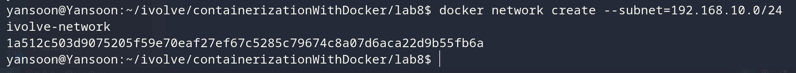
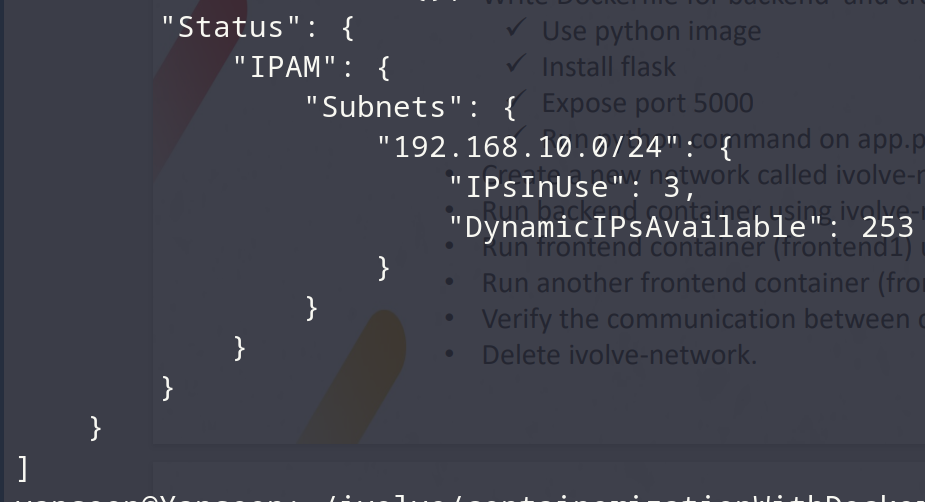
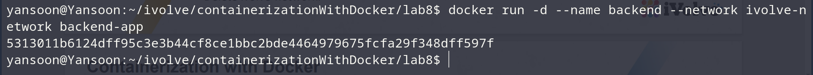
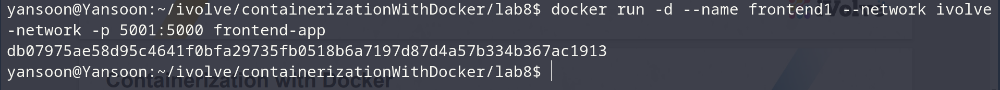
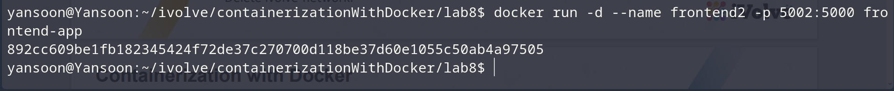
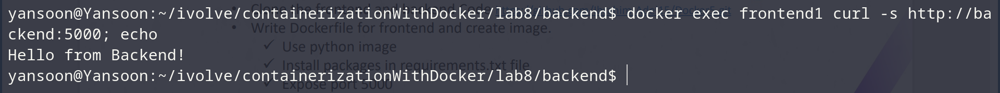
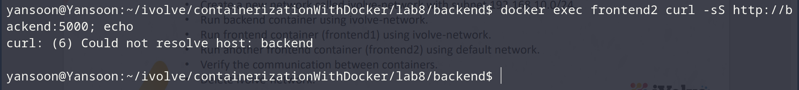
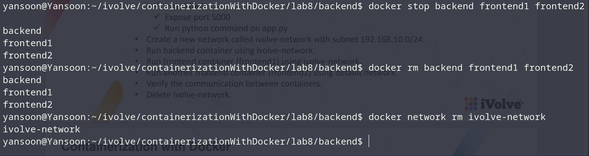

# Lab 8: Custom Docker Network for Microservices

## Objective
Build separate frontend and backend images, create a custom bridge network with
a defined subnet, then demonstrate how containers on the same custom network
can resolve and reach each other by name — while a container left on the
default network cannot.

## Application Source
Cloned from:
```
git clone https://github.com/Ibrahim-Adel15/Docker5.git
cd Docker5
```

## Frontend Dockerfile
```dockerfile
FROM python:3.13

WORKDIR /app

RUN groupadd -r appgroup && useradd -r -g appgroup appuser
COPY . .

RUN pip install -r requirements.txt

EXPOSE 5000

USER appuser

CMD ["python", "app.py"]
```

## Backend Dockerfile
```dockerfile
FROM python:3.13

WORKDIR /app

RUN groupadd -r appgroup && useradd -r -g appgroup appuser
COPY . .

RUN pip install flask

EXPOSE 5000

USER appuser

CMD ["python", "app.py"]
```


## Steps & Commands

### 1. Build the frontend image
```bash
cd frontend
docker build -t frontend-app .
cd ..
```


### 2. Build the backend image
```bash
cd backend
docker build -t backend-app .
cd ..
```


### 3. Create the custom network
```bash
docker network create --subnet=192.168.10.0/24 ivolve-network
```


Verify it:
```bash
docker network inspect ivolve-network
```


### 4. Run the backend container on ivolve-network
```bash
docker run -d --name backend --network ivolve-network backend-app
```


### 5. Run frontend1 on ivolve-network
```bash
docker run -d --name frontend1 --network ivolve-network -p 5001:5000 frontend-app
```


### 6. Run frontend2 on the default network
```bash
docker run -d --name frontend2 -p 5002:5000 frontend-app
```


### 7. Verify communication between containers
From frontend1 (same custom network as backend — should succeed, resolving
`backend` by container name via Docker's embedded DNS):
```bash
docker exec frontend1 curl -s http://backend:5000
```


From frontend2 (default network, no shared network with backend — should fail):
```bash
docker exec frontend2 curl -s http://backend:5000
```


The second command should fail to resolve/connect, since `frontend2` and
`backend` aren't on the same network. so `frontend2` can't resolve `backend` because it doesn't have a container named backend in its network.

### 8. Delete the network
```bash
docker stop backend frontend1 frontend2
docker rm backend frontend1 frontend2
docker network rm ivolve-network
```


> Containers must be stopped/removed (or at least disconnected) before the
> network can be deleted — Docker won't remove a network still in use.

## Project Structure
```
lab8/
│
├── frontend/
│   ├── app.py
│   ├── requirements.txt
│   └── Dockerfile
├── backend/
│   ├── app.py
│   └── Dockerfile
└── README.md
```

## Result
| Container | Network | Can reach `backend`? |
|---|---|---|
| frontend1 | ivolve-network (custom) | Yes — resolves by container name |
| frontend2 | default (bridge) | No — different network, no shared DNS |