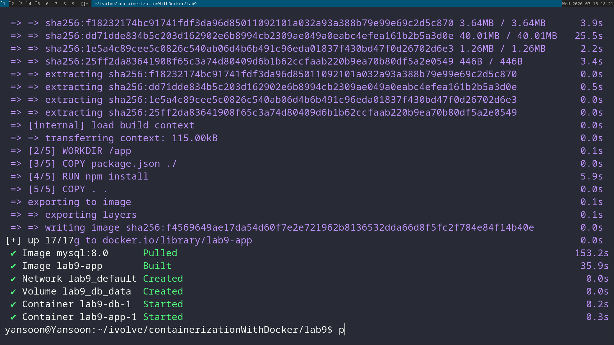
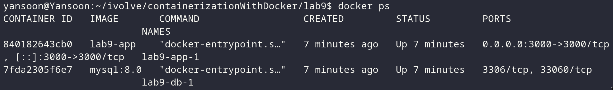
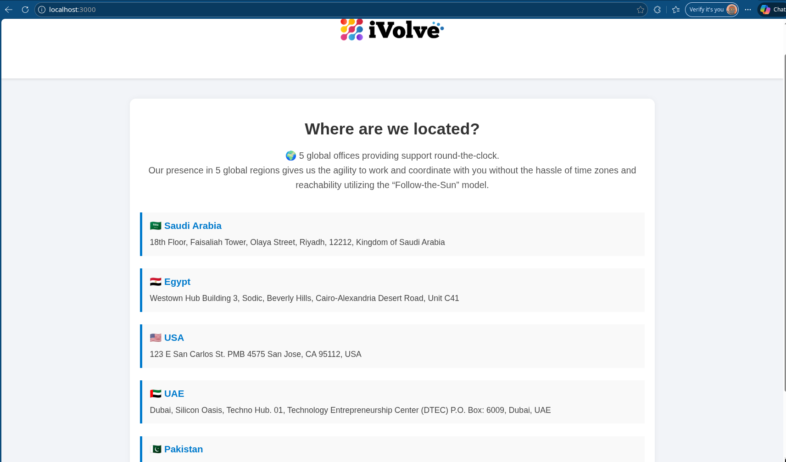
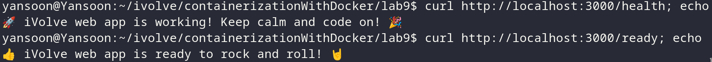
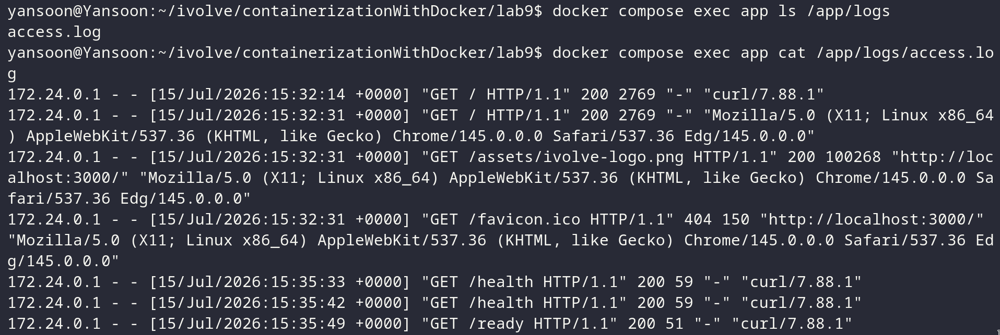
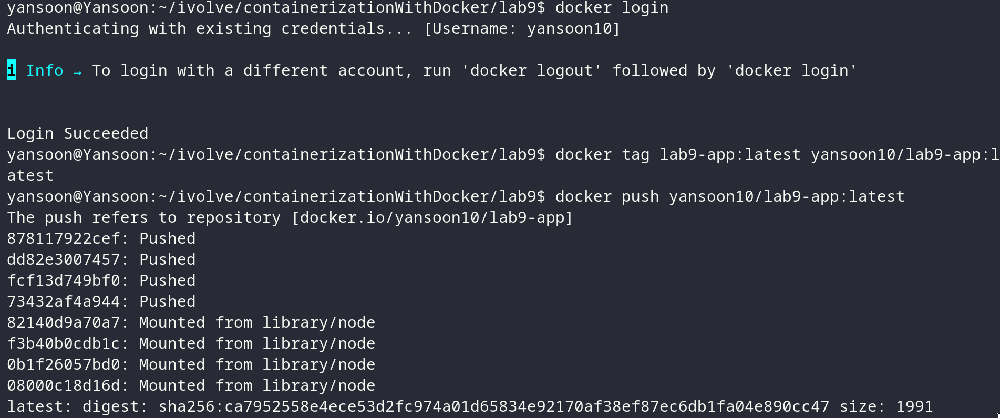

# Lab 9: Containerized Node.js and MySQL Stack Using Docker Compose

## Objective
Run a Node.js app and a MySQL database together using Docker Compose, with the
app connecting to MySQL over environment variables and the database's data
persisted in a named volume. Verify the app, its health endpoints, and its
logs, then push the built image to Docker Hub.

## Application Source
Cloned from:
```
git clone https://github.com/Ibrahim-Adel15/kubernets-app.git
cd kubernets-app
```


This repo already contains a `Dockerfile` for the app — Compose builds from it
directly, so no separate `docker build` step is needed.

## docker-compose.yml
```yaml
services:
  app:
    build: .
    ports:
      - "3000:3000"
    environment:
      DB_HOST: db
      DB_USER: root
      DB_PASSWORD: rootpassword
    depends_on:
      - db

  db:
    image: mysql:8.0
    environment:
      MYSQL_ROOT_PASSWORD: rootpassword
      MYSQL_DATABASE: ivolve
    volumes:
      - db_data:/var/lib/mysql

volumes:
  db_data:
```

**Design choices:**
- **`build: .`** on the `app` service — Compose builds the image from the
  Dockerfile already in the repo, rather than pulling a pre-built image.
- **`DB_HOST: db`** — `db` is the service name, and Compose's built-in network
  lets the app reach MySQL by that name, the same way container-name DNS
  worked on the custom network in Lab 8.
- **`MYSQL_DATABASE: ivolve`** — added beyond the base checklist. The lab states
  the app "must find a database named `ivolve` to start working," and this
  variable tells the MySQL image to auto-create that database on first startup,
  so the app doesn't fail looking for a database that doesn't exist yet.
- **`depends_on: - db`** — makes Compose start the `db` container before `app`.
  Note this only waits for the *container* to start, not for MySQL to finish
  initializing — if the app fails on its very first connection attempt, that's
  usually why, and a wait/retry loop in the app (or a healthcheck-based
  `depends_on`) is the typical fix.
- **`db_data:/var/lib/mysql`** — a named volume so the database's data survives
  container restarts/recreation, same pattern as the `nginx_logs` volume in
  Lab 7, just applied to MySQL's data directory this time.

> Adjust `DB_USER`/`DB_PASSWORD`/`MYSQL_ROOT_PASSWORD` values to match whatever
> the app's actual code expects — check the repo's source or its own README/
> `.env.example` if one exists, since these are placeholders.

## Steps & Commands

### 1. Clone the repo
```bash
git clone https://github.com/Ibrahim-Adel15/kubernets-app.git
cd kubernets-app
```

### 2. Add docker-compose.yml
Place the file above at the repo root, next to the existing `Dockerfile`.

### 3. Build and start the stack
```bash
docker compose up --build -d
```


Check both containers are running:
```bash
docker compose ps
```


### 4. Verify the app is working
it's a full webpage so we will check with the browser to see if the app is running on port 3000 or you can use curl command to check the app is running or not.
```bash
curl http://localhost:3000
```


### 5. Verify /health and /ready
```bash
curl http://localhost:3000/health
curl http://localhost:3000/ready
```


### 6. Verify app access logs at /app/logs/
```bash
docker compose exec app ls /app/logs
docker compose exec app cat /app/logs/access.log
```



### 7. Push the image to Docker Hub
```bash
docker login

docker tag lab9-app:latest <your-dockerhub-username>/lab9:latest
docker push <your-dockerhub-username>/lab9:latest
```


> Compose names the built image `<project-folder>-app` by default (here,
> `lab9-app`) — confirm the exact name with `docker images` before
> tagging, since the folder name after cloning determines this.

## Project Structure
```
kubernets-app/
│
├── frontend/
├── db.js
├── package.json
├── server.js
├── Dockerfile
├── docker-compose.yml
└── README.md
```

## Result
| Check | Outcome |
|---|---|
| App reachable on port 3000 | Confirmed via `curl` |
| `/health` endpoint | Confirmed via `curl` |
| `/ready` endpoint | Confirmed via `curl` |
| App connects to MySQL `ivolve` database | Confirmed by app starting successfully |
| Access logs present | Confirmed via `docker compose exec` / `docker compose logs` |
| MySQL data persisted in volume | `db_data` volume created and mounted |
| Image pushed to Docker Hub | Confirmed via `docker push` output |